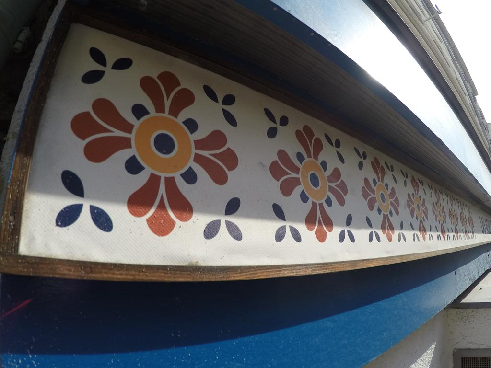
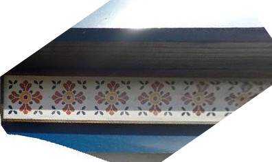
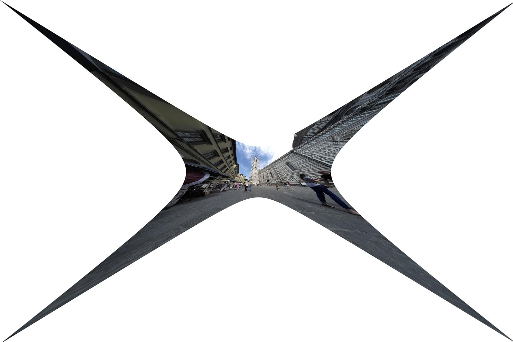

# Rectification from Coplanar Repeats
This framework rectifies imaged coplanar repeated patterns. Minimal solvers derived from constraints induced by coplanar repeated patterns are used in a LO-RANSAC-based robust-estimation framework. Affine-covariant features are extracted from the image for input to the solvers. Affine-covariant features are highly repeatable on the same imaged scene texture with respect to significant changes of viewpoint and illumination. In particular, the Maximally-Stable Extremal Region and Hesssian-Affine detectors are used. Affine frames are labeled as repeated texture based on the similarity of their appearance, which is given by the RootSIFT embedding of the image patch local to the affine frame. The RootSIFT descriptors are agglomeratively clustered, which establishes tentative correspondences among the connected components linked by the
clustering. Each appearance cluster has some proportion of its members that correspond to affine frames that give
the geometry of imaged repeated scene content, which are the inliers of that appearance cluster. The remaining affine
frames are the outliers.

LO-RANSAC samples pairs of affine frames from the appearance cluster, which are inputted to a minimal solvers. Each pair of affine frames across all appearance clusters has an equi-probable chance of being drawn.
The consensus with the minimal sample is measured by the number of pairs of affine frames within appearance groups
that are consistent with the hypothesized model normalized by the size of each respective group. A non-linear optimizer is used as the local optimization step of the LO-RANSAC estimator, which estimates a generative model of the iamged coplanar repeated pattern. 

## Download and Run 
Currently repeats runs only on x86-64 Linux systems. A version that runs on Windows will be added soon. Check back for frequent code updates. To start using repeats,
```
bash
git clone https://github.com/prittjam/repeats
cd repeats
matlab -nosplash -nodesktop -r demo
```
## Structure
- [`features`](features) - MATLAB wrappers for the feature detectors
- [`linear sovlers`](cvpr14/solvers) - minimal solvers proposed in [1](http://cmp.felk.cvut.cz/~prittjam/doc/cvpr14.pdf). 
- [`conjugate translation solvers`](cvpr18/solvers) - minimal solvers proposed in [2](https://arxiv.org/abs/1711.11339). 
- [`vgtk`](vgtk) - the visual geometry toolkit, a dependency implementing useful functions for projective geometry
- [`ransac`](ransac) - implementation of LO-RANSAC
- [`pattern-printer`](pattern_printer) - constructs the generative model of the imaged coplanar repeated pattern
- [`scene-sim`](scene_sim) - makes synthetic scenes containing coplanar repeated patterns
- [`external`](external) - contains dependencies from various authors and sources
- [`mex`](mex) - contains mex binaries for the feature detectors (Linux only)

### Input
The solvers are run on the images placed in the [input](input) subdirectory. If a result is already computed and placed in [output](output), then it is not computed again when [demo.m](demo.m) is rerun. 

### Output 
The undistorted and rectified images are placed in the [output](output) subdirectory. Some examples are shown below. 

## Images
Original | Undistorted | Rectified
:-------------------------:|:-------------------------:|:-------------------------:
  |   | 
  |   | 
  |   | 
  |   | 

## Feature Detection Parameters

## RANSAC Parameters
1. [RepeatSampler.m](TBD)
  * `min_trial_count`, minimum number of RANSAC trials
  * `max_trial_count`, maximum number of RANSAC trials
  * `max_num_retries`, maximum number of retries to find a valid sampling of the measurements
2. [RepeatEval.m](TBD)
  * `extentT`, the threshold of ratio of extent lengths of affine frames which defines inliers and outliers. 
 
## Pattern Printer Parameters


## Citations
Please cite us if you use this code:

[1] Detection, Rectification and Segmentation of Coplanar Repeated Patterns
```
@inproceedings{DBLP:conf/cvpr/PrittsCM14,
  author    = {James Pritts and
               Ondrej Chum and
               Jiri Matas},
  title     = {Detection, Rectification and Segmentation of Coplanar Repeated Patterns},
  booktitle = {2014 {IEEE} Conference on Computer Vision and Pattern Recognition,
               {CVPR} 2014, Columbus, OH, USA, June 23-28, 2014},
  pages     = {2973--2980},
  year      = {2014},
  crossref  = {DBLP:conf/cvpr/2014},
  url       = {https://doi.org/10.1109/CVPR.2014.380},
  doi       = {10.1109/CVPR.2014.380},
  timestamp = {Thu, 15 Jun 2017 21:35:56 +0200},
  biburl    = {https://dblp.org/rec/bib/conf/cvpr/PrittsCM14},
  bibsource = {dblp computer science bibliography, https://dblp.org}
}
```
[2] Radially-Distorted Conjugate Translations
```
@article{DBLP:journals/corr/abs-1711-11339,
  author    = {James Pritts and
               Zuzana Kukelova and
               Viktor Larsson and
               Ondrej Chum},
  title     = {Radially-Distorted Conjugate Translations},
  journal   = {CoRR},
  volume    = {abs/1711.11339},
  year      = {2017},
  url       = {http://arxiv.org/abs/1711.11339},
  archivePrefix = {arXiv},
  eprint    = {1711.11339},
  timestamp = {Mon, 04 Dec 2017 18:34:59 +0100},
  biburl    = {https://dblp.org/rec/bib/journals/corr/abs-1711-11339},
  bibsource = {dblp computer science bibliography, https://dblp.org}
}
```
